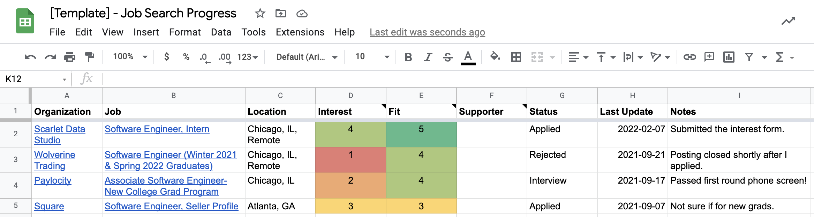

The first step of a job or internship search is finding relevant roles. You can always come back to this step to look for new opportunities.

## Outline

1. Find organizations
2. Prioritize organizations
3. Prepare to apply
4. Track your progress

## Getting Started

As you go through this guide, open the **Jobs** tab of your job search progress tracker spreadsheet. (Don't have a progress tracker? [Apply](../apply) to Scarlet Data Studio's internship and we will send you one!)

We recommend following the LAMP method, from the book "The 2-Hour Job Search" by Steve Dalton. You can ask Career Services for a copy of the book or refer to [these summary slides](https://www.slideshare.net/kocharsimardeep/the-2-hour-job-search-book-summary-63004716) by Simardeep Kochar. LAMP stands for: **L**ist, **A**lumni, **M**otivation, and **P**ostings. First, you create a list of organizations, then you prioritize your list based on alumni, motivation, and postings.

## 1. Find Organizations

This step starts on [slide 5](https://www.slideshare.net/kocharsimardeep/the-2-hour-job-search-book-summary-63004716).

Create a list of 40 organizations. Add one row to your tracker for each organization you find. Fill your list with:

- Organizations you have heard of
- Organizations you admire
- Organizations you wish to be part of
- Organizations where Illinois Tech alumni work ([LinkedIn shows you some employers](https://www.linkedin.com/school/alumni))
- Organizations related to industry trends that interest you
- Organizations that appear on job boards
- Organizations that have internships or apprenticeships
- Organizations that have roles specifically for new or recent graduates

In this step, you do not need to do any research about the organizations, just list them.

### Job Boards

Here are some job boards you can use to create your list of organizations. At this stage, focus on the organization, not the role.

- [Handshake](https://iit.joinhandshake.com/)
- [Indeed](https://www.indeed.com/)
- [Built In Chicago Job Board](https://www.builtinchicago.org/jobs)
- [Key Values](https://www.keyvalues.com/)
- [Hiring Without Whiteboards Company List](https://github.com/poteto/hiring-without-whiteboards)
- [Coding It Forward Job Drop Email Newsletter](https://us15.campaign-archive.com/home/?u=9254473a71d61ff7556fa5215&id=d4710348b9)
- [Justice Tech Download Email Newsletter](https://www.justicetech.download/)
- [80,000 Hours Job Board](https://80000hours.org/job-board/)

## 2. Prioritize Organizations

This step starts on [slide 13](https://www.slideshare.net/kocharsimardeep/the-2-hour-job-search-book-summary-63004716).

### Interest Ratings

Assign a rating to each organization based on your interest in working there. Add a link to the organization in your spreadsheet.

1. Completely unfamiliar
2. Very little interest
3. Somewhat interested
4. Very interested
5. Extremely interested

### Fit Ratings

Find the organization's careers page, if any. If they have job postings, pick the one that you think is the best fit for you and assign a rating. Add a link to the job posting in your spreadsheet.

1. No job postings
2. Has at least one posting
3. Meet one requirement for posting
4. Meet more than one requirement
5. Meet many requirements

### Supporters

Do you know an alum, friend, or someone else who works there or can introduce you to someone who works there? If so, write down their name in the "Supporter" column.

If an alum works there but you do not know them, you can write down their name or just write "Alumni" in the cell.

It is okay if you do not know any or many supporters. Check out these resources for advice on finding a supporter:

- [Join The Bridge at Illinois Tech](https://iit.wisr.io/signup)
- [Two Hour Job Search Slides](https://www.slideshare.net/kocharsimardeep/the-2-hour-job-search-book-summary-63004716)
- [Luck Surface Area](https://www.codusoperandi.com/posts/increasing-your-luck-surface-area)

### Further Research

Sort your list and check out the organizations you rated as 1 for interest or 3-5 for fit to learn more about them. You can add more organizations to your list as you find out more.

## 3. Prepare to Apply

Now you have a list of relevant roles! [Once your resume is ready](../guide/revising-resume), you can start applying.

**Suppoters and Referrals**: If you know a supporter, you should wait to apply to the role. Ask if you can chat with them about the organization (or if they can introduce you to someone). If the supporter is an employee, they may be able to refer you to the role, which gives you a better chance of getting invited to an interview.

**Qualifications**: Any role you rated 3-5 for fit is a role you could apply to. It is good to apply to roles where you meet more of the requirements, but sometimes a role where you only meet one requirement could still be a good fit! Use your best judgement based on the role description or ask for advice.

**Roles For Students**: If a role is specifically for students of your level, you should apply even if you only meet one requirement. Some internship postings will say whether the internship is for undergraduates or graduate students, and what years (first-years, second years, etc.) are eligible. For full-time job seekers, some postings will indicate that they are for new or recent graduates.

**Apply to One Role per Employer**: An employer may have multiple roles that you are interested in, but you should pick just one to apply to. Some companies automatically filter out candidates who apply to multiple jobs at their company thinking it is spam. Pick the role you like best. If you move forward in their application process, a recruiter or hiring manager can help you switch to a different job in case that would be a better fit for you.

Once you are ready, send out all your applications. You do not need to spread them out or wait, the sooner you apply, the better.

## 4. Track Your Progress

In each row, keep track of the status and the date that you reached that status. Here are the options for status:

- **Saved**: You added this organization and role to your list
- **Applied**: You submitted your application
- **Reminded**: You have not heard back, so you asked for an update on your application
- **Rejected**: The organization informed you that they will not move forward with your application
- **Interview**: You are interviewing with the organization
- **Offer**: You reeived a written offer
- **Accepted**: You signed the offer

**Reminders**: Many organizations will not inform you of your application status. If no timeline is provided, as a rule of thumb, wait two weeks before asking for an update. At that point, search for an appropriate contact (usually a recruiter) and email them to inquire about the status of your application. They may have not seen your application yet, or you might hear that you are no longer being considered.
