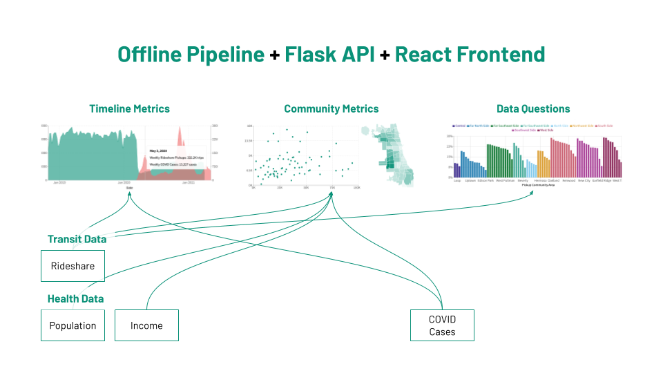
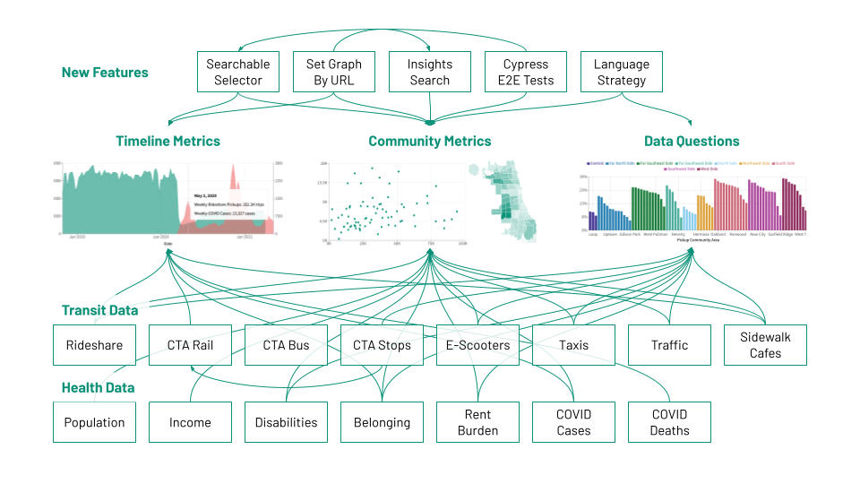
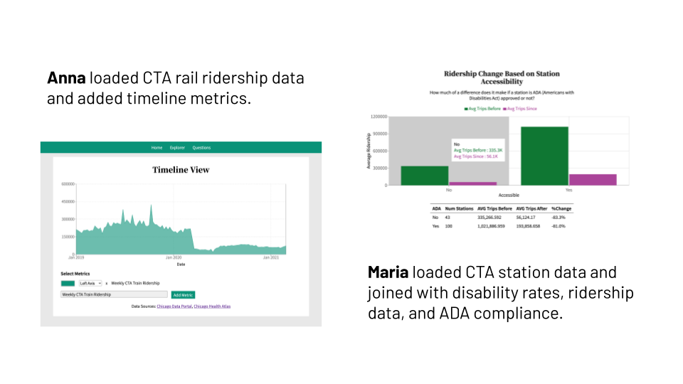
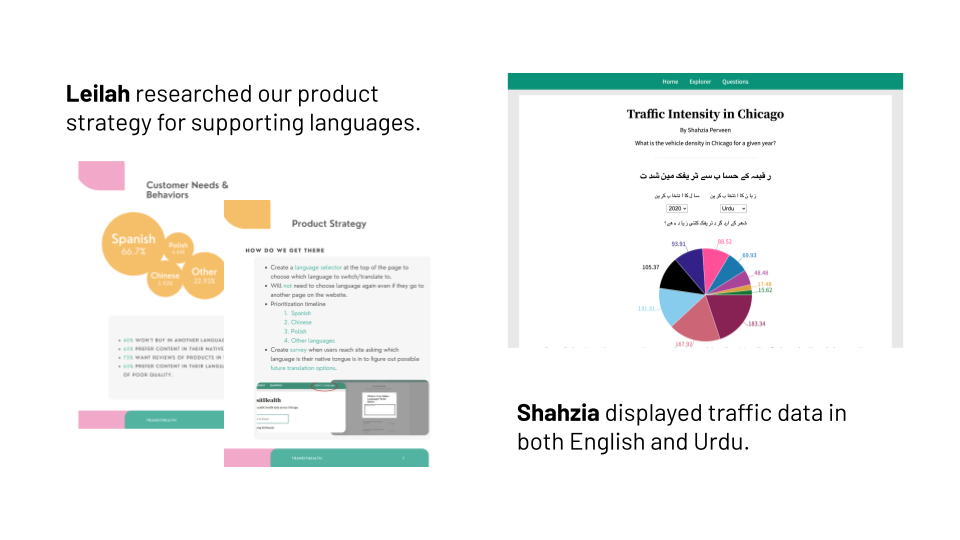
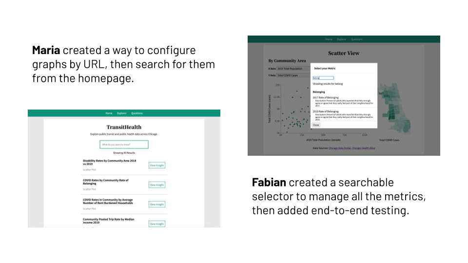

In summer 2021, six Illinois Tech alumni ran a paid software engineering internship for ten current students, all of whom are underrepresented in computer science.

# Goals

- Create opportunities for underrepresented students who are overlooked by industry.
- As mentors, practice multiplying the impact of developers on our team.

# Product

Our team of 16 engineers built [TransitHealth](https://scarletstudio.github.io/transithealth){:target="_blank"}, a website for Chicago residents to explore how transportation and public health data have changed since COVID.

Chicago city agencies publish open data daily, but people need familiarity with data analytics or specialized tools to use it. Our website helps educators and curious citizens explore the data.

**Above:** Screenshot of the TransitHealth website, on the data explorer page.

# Projects

During the internship, each intern:

- Took ownership of adding a challenging dataset as their introduction to the codebase.
- Had the opportunity to try every part of our system: offline pipeline, API, and frontend.
- Deployed changes into production and prepared a blog article about their contributions.

These diagrams show how the functionality of TransitHealth evolved through the internship:

**Below:** Diagram representing the data and features in TransitHealth before the internship.

**Below:** Diagram representing the data and features in TransitHealth after the internship.

Here are summaries of each intern’s main contributions:

- **Anna** added CTA train ridership data over time before and after COVID, then identified the most popular CTA train stops using data over the past two decades.
- **Asude** added data about sidewalk cafe permits over time and then used their longitude and latitude coordinates to match them to community areas.
- **Camilo** loaded CTA bus ridership data over time, before and after COVID.
- **Fabian** added belonging rates by area, over time, and by ethnicity; created a searchable modal to select metrics; and set up integration testing with Cypress and GitHub actions.
- **Jackie** conducted a cybersecurity audit of our website: testing DOM and SQL injection attacks, updating our security headers, and fixing a vulnerability we added.
- **Leilah** added taxi data on average speed, payment methods, and drop-off locations; then researched our product strategy for localization and language support.
- **Maria** added disability rates by area, visualized ridership changes in ADA-accessible CTA stops, created a way to customize graphs via URL parameters, and developed the search feature on our home page for visitors to find and jump to graphs of interest.
- **Shahzia** added traffic intensity data by area, then created a page with a traffic intensity data visualization and descriptions, in both English and Urdu.
- **Tabor** added e-scooter trip data by area, then added metrics on COVID cases and deaths over time and by age group.
- **William** added data about rent-burdened households by area and peak levels, created an interactive chart, and compared change in rideshares to/from O’Hare airport after COVID.

# Collaborations

These screenshots demonstrate some situations where interns’ contributions came together to make the product more than the sum of its parts:

**Above:** Anna loaded data that opened up new possibilities for Maria, who linked both transit and public health data to display trends related to transit accessibility.

**Above:** Leilah and Shahzia demonstrated why and how TransitHealth should support more languages.

**Above:** Maria and Fabian launched features to make the deluge of new metrics usable.

# Read More

If you want to learn more about the experience from the perspective of the interns, check out some of their blog articles:

- Fabian writes about [his internship contributions](https://fabrego524.github.io/PersonalWebsite/Blog/index.html){:target="_blank"} from building new UI components to squashing bugs with automated testing in Cypress
- Leilah writes about [her stretch project](https://alkatoutl.github.io/blog/stretchproject){:target="_blank"} to develop a new product strategy for language support in TransitHealth
