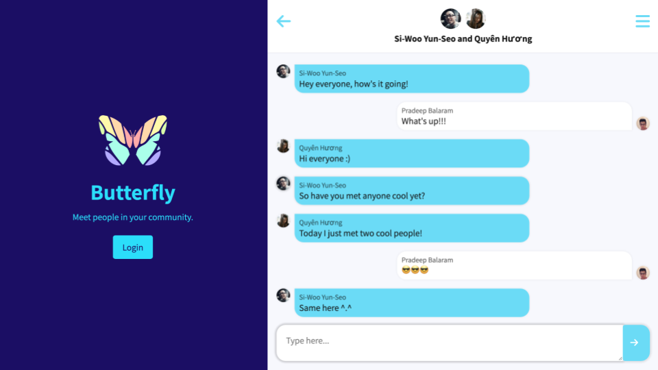
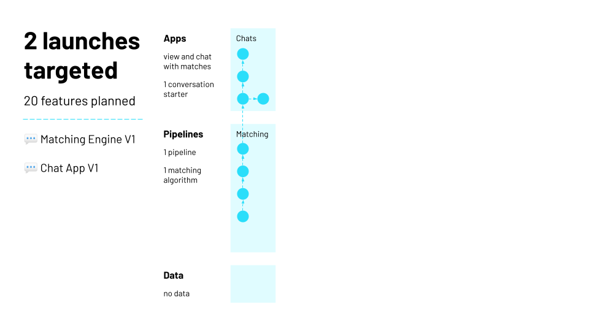
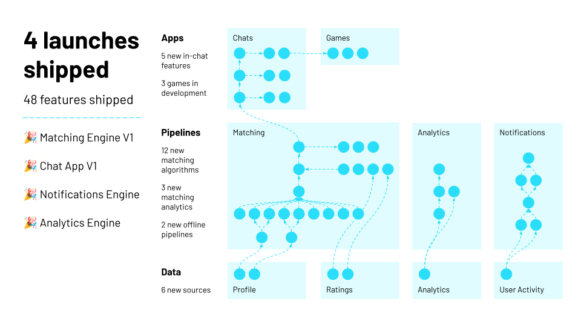

In summer 2022, nine Illinois Tech alumni ran a paid software engineering internship for 20 current students, all of whom are underrepresented in the technology industry.

We are grateful to Illinois Tech Career Services and all the alumni and community members who made this program possible with their contributions. Thank you for helping these students grow!

# Goals

- Create opportunities for underrepresented students who are overlooked by industry.
- As mentors, practice multiplying the impact of developers on our team.

# Product

Our team of 29 engineers built [Butterfly](https://scarletstudio.github.io/butterfly){:target="_blank"}, a social app that matches people to others in their community so they can chat and form new connections.

Participants create a profile where they select interests and areas where they want to give or receive support. Each week, we run our matching engine to pair people up based on what they are looking for and they can start getting to know their buddy in our chat app.

**Above:** Screenshot of the Butterfly app, with login page and a group chat.

# Projects

During the internship, each intern:

- Took ownership of adding a new feature to either our chat app or matching engine.
- Wrote tests, passed code review, and used our own app to meet other interns.
- Worked with their mentor to identify a stretch project related to their interests.

We are proud of the interns for accomplishing so much over the six week part-time internship:

- 20 interns contributed at least one pull request
- 19 interns launched a core project
- 19 interns completed a stretch project
- 6 interns completed multiple stretch projects
- 6 interns designed and built new systems

These diagrams show how the functionality of Butterfly evolved throughout the internship:

**Below:** Before the internship, we planned to ship 20 features for two main launches: our matching engine and chat app.

**Below:** By the end of the internship, we had shipped 48 features across four launches, including new notifications and product analytics systems.

This was the first year that Scarlet Data Studio had dedicated frontend developers. Check out all that they accomplished while building the Butterfly chat app:

- **Amir** (and Prince) launched the match ratings feature and wrote a Python script to calculate who happy users are with their matches.
- **Dinora** (and Vinesh) launched the interests editor, community selector, a conversation starter, and a fun facts game.
- **Grace** (and Spriha) launched the block users feature to make our app more safe, and hid chats with blocked users from the inbox.
- **Liliana** (and Ramir) launched conversation starters for interests and started learned React from scratch in four weeks.
- **Luis** (and Prince) launched the intent upvotes feature and enhanced the chat inbox to show you messages you have responded to.
- **Marilyn** (and Vinesh) launched the intents editor, added more intents, created a schedule grid, and built a two truths and a lie game.
- **Nida** (and Spriha) launched a feature to search chat messages, improved search logic and user experience based on feedback.

Also, special congratulations to **Sara**, who accepted a full-time job as a software engineer in the first week of the internship!

Our offline pipeline developers were hard at work as well. Check out their achievements from building the Butterfly matching engine:

- **Alhassan** (and Anna) ranked match stars, normalized ratings based on users’ average ratings, and designed an interests taxonomy.
- **Ayman** (and Erik) launched the rare interests generator, and designed and built the backend of a word guessing game.
- **Azucena** (and Vinesh) connected intents data to the pipeline; wrote functions to find matches, rank notifications and calculate metrics.
- **Bridget** (and Erik) launched the similar interests generator and implemented logic for a new notification that we can send to users.
- **Chris** (and Vinesh) connected interests data to the pipeline, built analytics, and designed and built a new notifications pipeline.
- **David** (and Edwin) ranked matches to give users more variety, fixed a critical production bug, and extracted chat data for pipelines.
- **Emma** (and Rachael) launched the similar schedules generator and implemented analytics about users’ availability in a community.
- **Lauren** (and Arushi) launched the rare intents generator and designed and built a pipeline to calculate product analytics.
- **Luke** (and Rachael) launched limited schedule matching and created functions to help manage availability data.
- **Nelida** (and Edwin) ranked matches to help users with fewer options and designed and built a system to cluster users.
- **Neveen** (and Arushi) launched the rare intents generator and calculated analytics on distribution of intents in a community.
- **Verica** (and Anna) ranked matches based on upvotes for helpful users and designed and built a location matching generator.

# Thank You!

We appreciate your support and advocacy for our students. Read how this internship impacted them in their own words:

> "My time with Scarlet Data Studio was an invaluable first step in my software engineering career. I loved how my contributions essentially paved the way for my peers to contribute to and refine a core feature of Butterfly, our project at the time."

> “This internship challenged my abilities in new ways since I had never been a part of a larger project and expected to contribute in such a significant way. I quickly learned how to use new tools, familiarized myself with new coding languages, and developed better software engineering skills!”

> “It was neat that each intern was given a specific area within the codebase to improve and/or add features to. This gave the feeling that everyone was equally impactful when making contributions to the project.”

> “I liked that I was able to apply the knowledge and skills from school to a real world problem... Some challenges I faced were using different data structures that I’ve learned to make my code the most efficient and understanding what people have already done and then fitting my code in with theirs...”

> “I cherished Scarlet Data Studio for one thing in particular: it advanced my ability as a software engineer. My skills were challenged and improved in every area. My mentor addressed me with utmost consideration and patience, and supplied me with all the tools I needed to handle front-end engineering duties. Scarlet Data Studio gave my colleagues and me access to a DEI environment that served as a reminder of how a true engineering team should engage. I feel assured of my ability to land my next software engineering position after finishing this internship.”
