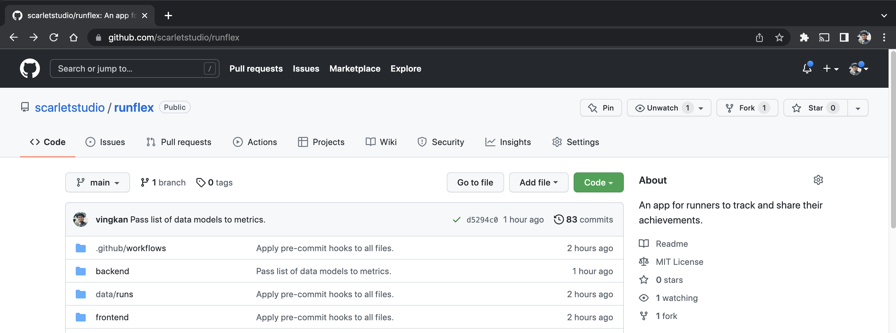
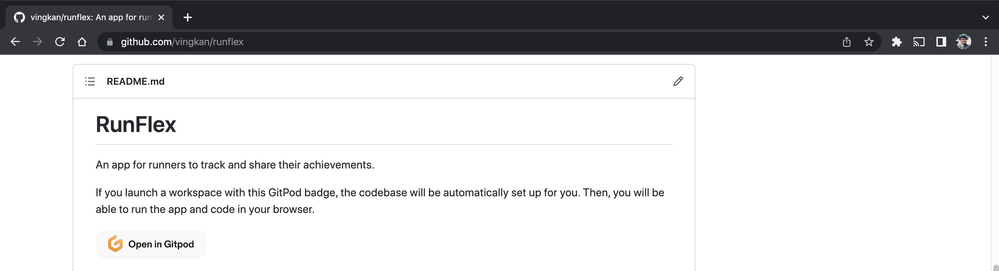
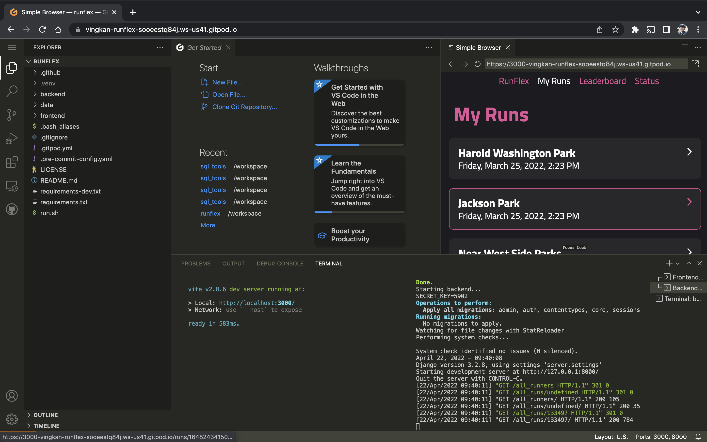
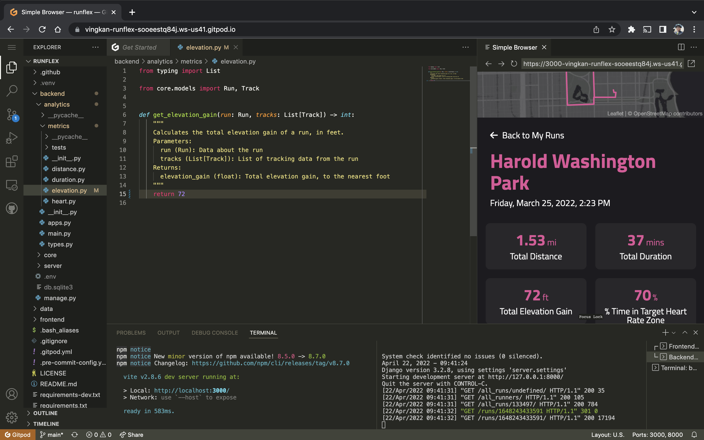
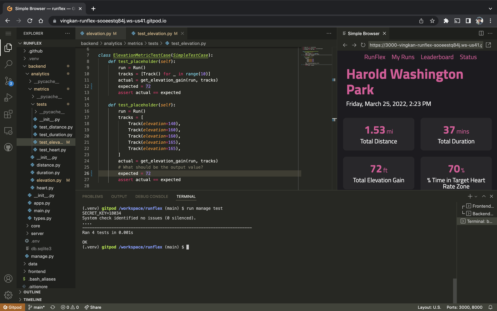

# Backend Software Engineering for RunFlex

This summer, the interns in the virtual software engineering internship will build features for the backend API of RunFlex: an app for runners to track and share their achievements.

RunFlex processes GPX data from a run and shows metrics for each run. In this exercise, you will get started in the codebase and implement one of those metrics: **elevation gain**.

Completing this exercise will give you a brief introduction to the tools and concepts the interns will work with as well as show our team how you would ramp up to a new software engineering project.

This exercise should not take more than 90 minutes of your time. To do this exercise, you will need a computer, a modern browser, and an internet connection. No installation is necessary, everything can run in your browser.

Contact Vinesh Kannan (v@hawk.iit.edu) if you have any questions.

## Instructions

### Step 1. Fork the repository on GitHub

First, you need to get your own version of the codebase.

- Make a GitHub account if you do not already have one.
- Go to [the main RunFlex repository](https://github.com/scarletstudio/runflex/){:target="_blank"} on GitHub.
- Click the Fork button in the top right corner of the screen.
- Fork the repository using your GitHub account.

### Step 2. Launch the online editor with GitPod

Next, you will start up GitPod, a tool that will allow you to run the app and contribute code without having to set up your own environment.

- Go to your fork of the RunFlex repository.
- Click the GitPod badge on the README.
- Log into GitPod using your GitHub account.

- Wait for the app to load on GitPod.
- Your terminals should look like those in the image below when the app is running.

- Now you can play around with the app and edit code.

### Step 3. Read the backend documentation

Next, the documentation will give you direction on how to navigate the backend codebase.

- Read the README section entitled "Backend Development" and find the files it mentions.
- Follow the documentation to find where the elevation gain metric is calculated.
- Try changing the placeholder return value for elevation gain, then refresh the app in the mini browser to see the new value in the app.

### Step 4. Implement the elevation gain metric

- Before starting your work, create a new git branch for your changes.
- The elevation gain metric shows the total amount of elevation gained during the run in feet, rounded to the closest foot.
- The metric function takes two inputs, the second input `tracks` is a list of run tracking data which includes elevation data.
- Think of what logic is needed to calculate elevation gain and what cases need to be handled.
- Remove the placeholder value and write your implementation for calculating elevation gain.
- Use commits to store your progress.

### Step 5. Test the elevation gain metric

- Find the file where the tests for elevation gain are specified.
- Write your own test cases to make sure elevation gain is calculated correctly.
- Refresh the mini browser to try out your metric on the run data in the app.
- Run all tests to make sure they pass.

### Step 6. Push your changes and open pull request to your own fork

- When you have completed your implementation and tests, push your commits to your branch on your fork.
- Go to your fork of the repository and open a pull request from your branch to the main branch of your own fork.
- Write a description for your pull request that includes the following:
  - What did you find easy and what did you find hard about this exercise?
  - What are three things that you observed about this app and codebase?
- Add Vinesh Kannan ([@vingkan](https://github.com/vingkan){:target="_blank"}) as a reviewer for the pull request.
  - You may need to add me as a maintainer under your repository settings. If you have trouble, you can email me the link to your pull request.
- We will check out your work and leave feedback for you!
