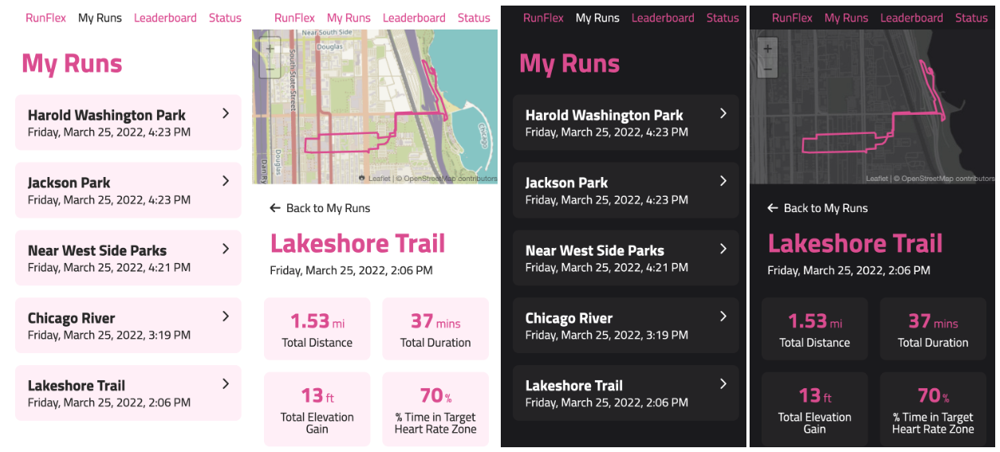

# Seeking Tech Leads for a Virtual Internship!

**Note:** Unfortunately, we will not be running this specific program in summer 2022, but plan to launch it next year. If you are interested in becoming a tech lead, feel free to fill out the form below.

Do you want to help Illinois Tech students grow as software engineers and improve your own engineering leadership skills? We are looking for tech leads to manage teams of student interns in a new, virtual software engineering internship.

Scarlet Data Studio is partnering with GlobalShala to offer a virtual internship for Illinois Tech students who want to try out software engineering. Interns will work in teams of four to build the backend for an app for runners. Each intern will implement, test, and design backend features.

Tech leads will manage up to two teams, for a total of 4-8 students. As a tech lead, you will support these engineering teams by pointing them in the right direction to launch their features, coaching them on how to improve, and stretching your own engineering leadership skills.

Illinois Tech students who have some experience related to software engineering would be great candidates for this role. Our team of alumni software engineers will coach you on ways to grow in your own career. Read the details below to learn about the responsibilities and recommended skills.

  <a class="big button primary splash contrast" href="{{ page.interest_form_link }}" target="_blank">
    Apply Now
  </a>

Contact Vinesh Kannan (v@hawk.iit.edu) if you have any questions.

## Application Timeline

- Apr 22: Tech lead application opens
- May 23: Tech lead application closes
- May or June: Tech lead training starts
- July or August: Virtual internship starts

## Internship Details

This virtual internship is four weeks long. Internship dates are yet to be announced, but the program will take place in July or August and run from the start to the end of the month.

Read the [virtual internship blueprint]({{ page.blueprint_link }}){:target="_blank"} for more details about the internship, projects, and schedule.

## Tech Lead Role

### Compensation

Tech leads will be paid. Details to be announced.

### Time Commitment

6-8 total hours per week, for four weeks.

### Responsibilities

- Complete tech lead training and onboarding to understand the project
- Manage up to two teams (4-8 interns) working on backend software engineering
- Host team meetings during the week to discuss progress and answer questions
- Participate in the Discord community for the interns and other tech leads
- Coach interns on how to proceed when they get stuck on a project
- Give sign-off when interns meet the requirements for a project
- Provide feedback to interns on how they can improve their work
- Take part in 1:1 meetings with an alumni software engineer to aid your growth
- Help train future tech leads to be successful in this role

Projects, codebase, and documentation will be provided. 

### Recommended Skills

Below are skills that will help tech lead succeed in their role. If you have some of these skills, we encourage you to apply.

- Some prior experience with software engineering, coding, or computer science
  - For example: internships, hackathons, teaching, personal projects, or class projects
- Some prior experience with teaching, student leadership, or team management
- Comfortable coding in Python, or another programming language
- Comfortable using git and GitHub (or other similar tools)
- Some prior experience with data structures and algorithms

After submitting the [interest form]({{ page.interest_form_link }}){:target="_blank"}, you will receive an email with instructions for an exercise where you will be able to try part of the project that the interns will work on. The exercise should not take more than 90 minutes of your time.
