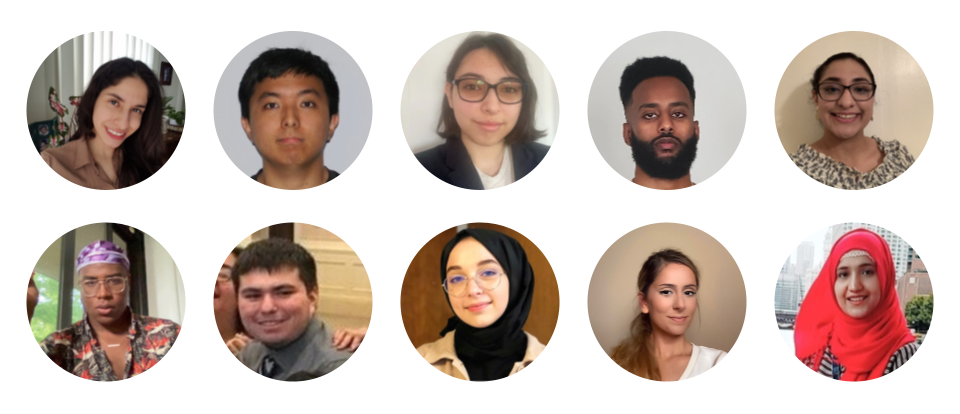
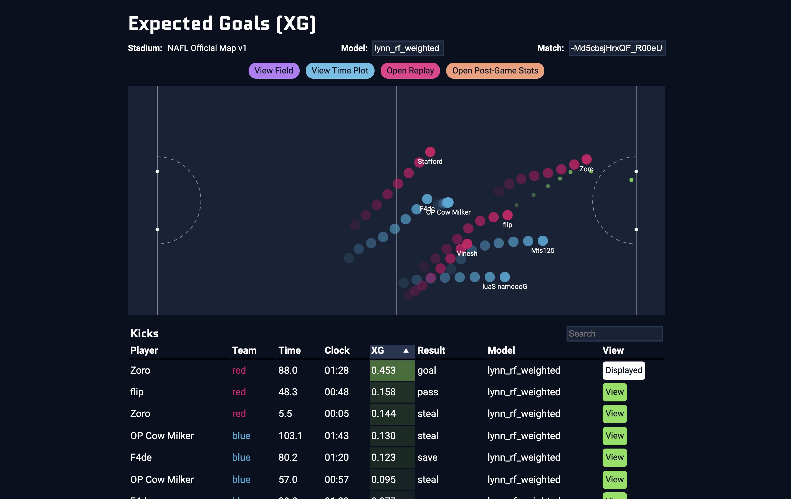
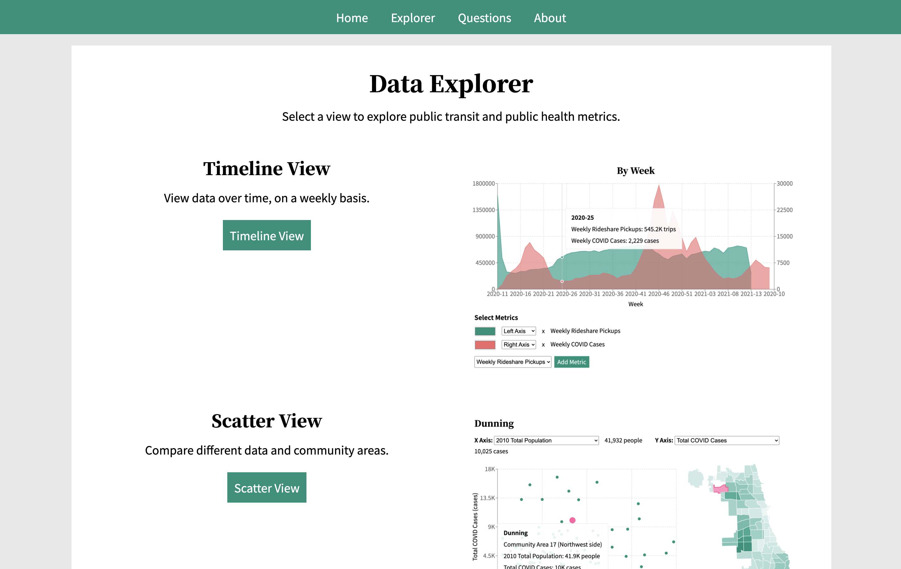

# Fund Paid Internships For Aspiring Software Engineers

With your support, we are prepared to create 20 new, paid software engineering internships in summer 2022 for Illinois Tech students from underrepresented backgrounds!

## Designed For Our Students’ Needs

Many talented and hard-working students do not find an internship, for reasons ranging from lack of industry knowledge to time-consuming responsibilities outside of school.

To address this need, alumni and staff at Illinois Tech have created new opportunities to fit the needs of those students, especially women, minorities, and first generation students.

Last summer, we created paid internships for ten students, and we plan to host 20 next summer!

Scarlet Data Studio supports underrepresented students who are prepared for a software engineering internship but have not been able to land an opportunity. We create six-week paid internships where students own meaningful features and ship code to production, mentored by Illinois Tech alumni who work professionally as software engineers.

The program helps students create a support system, grow their confidence, demonstrate software engineering skills, see the impact of their work on others, and find their next role.

> "I learned how projects are structured and I feel better about joining a larger project and learning to navigate its components. I liked the topic, it was interesting. I also liked all the people I met and I especially liked my mentor who was cool af"

> Summer 2021 Intern

  <a class="button primary big" href="{{ page.donate_link }}" target="_blank">
    Donate
  </a>

## Meaningful, Challenging Projects

In winter 2020, two interns developed and deployed online machine learning models to predict soccer goals, trained on 300,000+ plays collected from an online game.

In summer 2021, ten interns built a website showing how Chicago public health and public transit data changed since COVID, adding 15 datasets, 14 data stories, and 120+ metrics.

Your support will help us fund the third cohort of interns!

> "With all the documentation and guidance and meetings, you will start to get the hang of it and create some really cool things! This project became something I looked forward to and something that I could get lost in and was fun."

> Winter 2020 Intern

## Directly Impact Students

Next summer, we plan to host 20 interns. Your charitable donation will fund the stipends of students and mentors and help extend this opportunity to more students.

If you want to help this program serve future cohorts of students, please pledge your donation for the next three years or more.

> This internship was such a highlight in my interviews and it impressed the interviewers so much. I learned a lot from you two and wouldn't have been able to land this job without you.

> Summer 2021 Intern

  <a class="button primary big" href="{{ page.donate_link }}" target="_blank">
    Donate
  </a>

Thank you for giving forward to Illinois Tech students and helping create a more equitable and inclusive technology industry!
